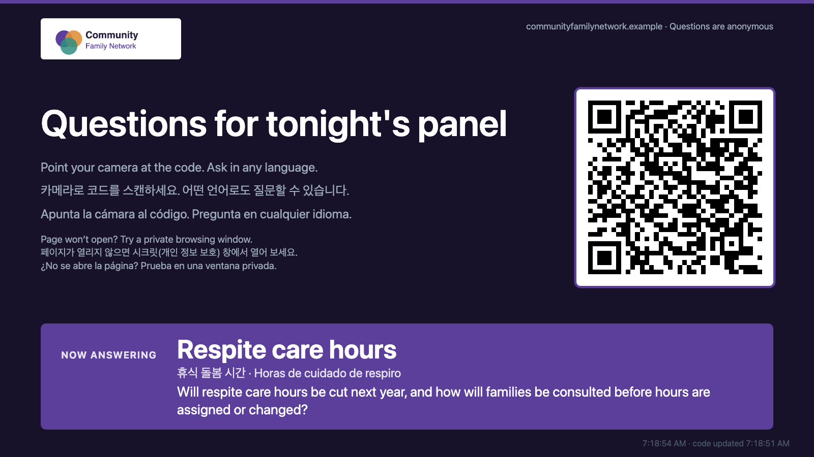
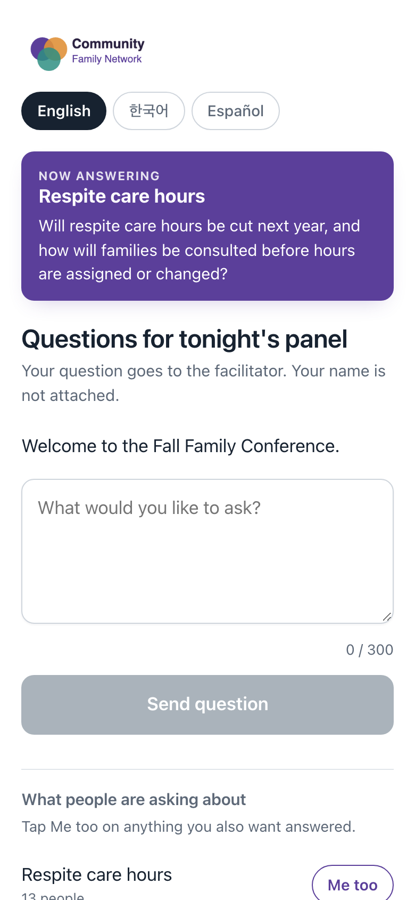
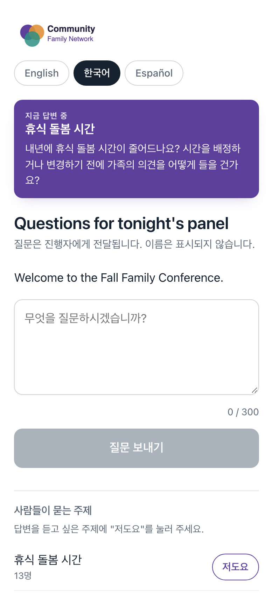
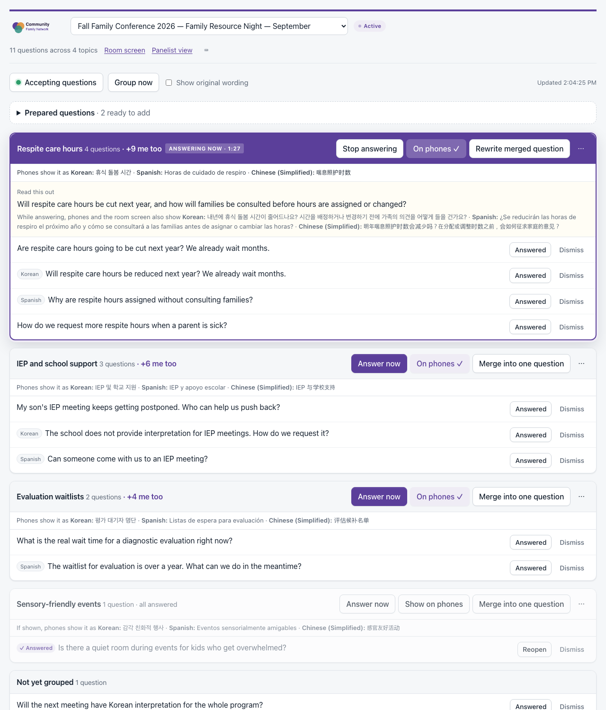
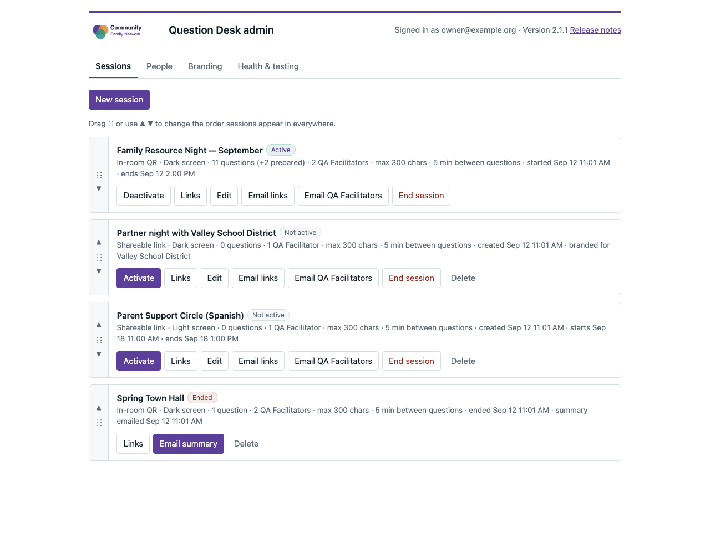
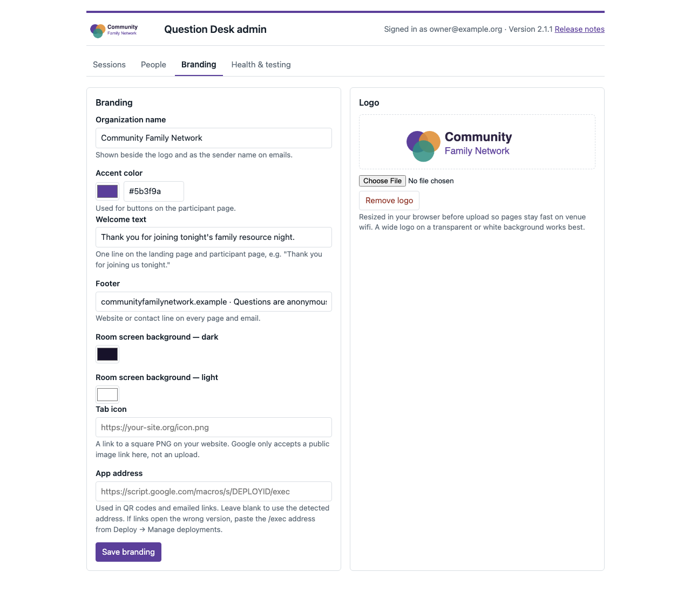
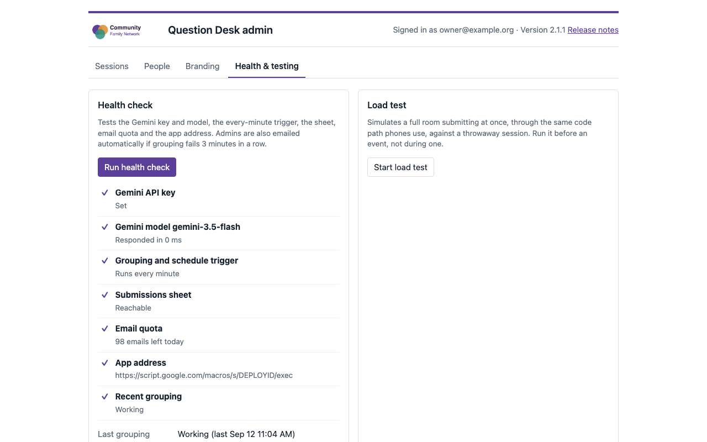
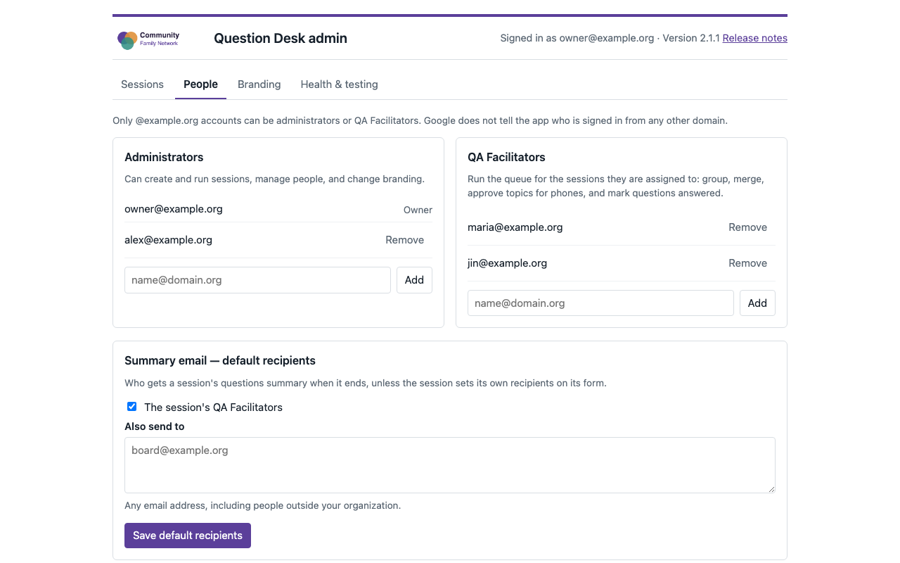
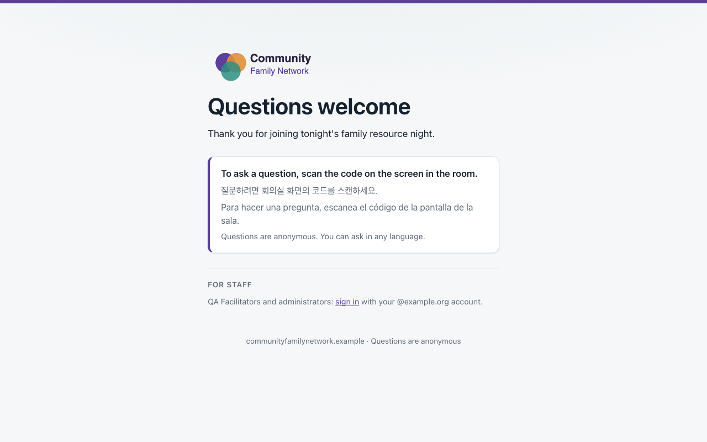
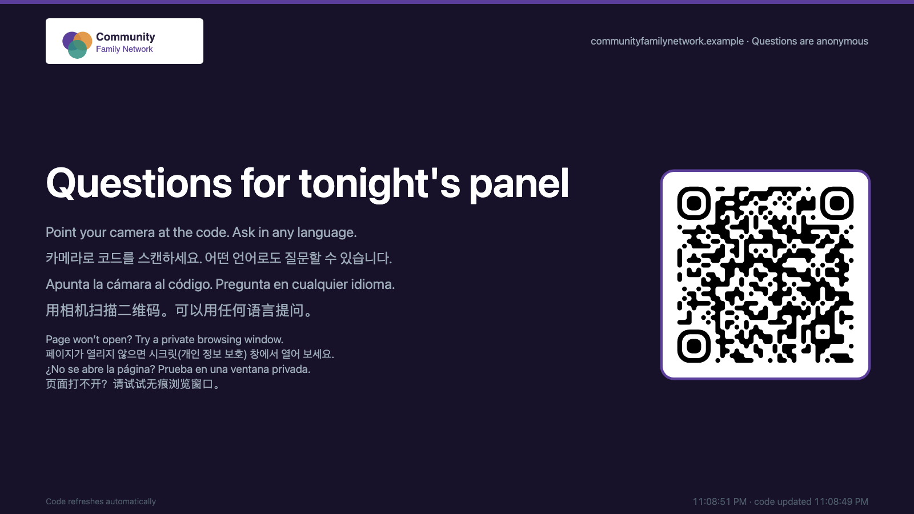

# Question Desk

Anonymous audience Q&A for community meetings, built as a Google Apps Script web app
with Gemini grouping and translating questions. It runs entirely inside an
organization's own Google Workspace. There is no server to host and nothing for the
audience to install.

Built to support the **Autism Society of Los Angeles**.

[](https://github.com/djsincla/question-desk/actions/workflows/test.yml)
License: Apache 2.0

## How it works

1. The **room screen** shows a QR code. For in-room sessions the code changes every
   150 seconds, so only people in the room can ask.
2. People scan it and **ask anonymously** in English, Korean, Spanish, or any language.
3. Gemini **groups questions by topic** and translates them in one call, so a Korean
   and a Spanish question about the same thing land in the same group.
4. The facilitator's **queue** shows topics instead of a long list. They merge a topic
   into one question to read aloud, and mark it **Now answering** on the room screen
   and everyone's phone.
5. Participants can tap **Me too** on topic labels, never on other people's questions,
   so the room's priorities surface without repeat questions.
6. When the session ends, QA Facilitators get a **summary email** with a CSV.

## Screenshots

All screenshots use made-up demo data from `scripts/preview.js`.

**Room screen:** QR code, instructions in three languages, and the topic being answered.



<table>
  <tr>
    <td width="50%"><strong>Participant's phone</strong><br>Ask anonymously; tap <em>Me too</em> on approved topics.<br><br></td>
    <td width="50%"><strong>The same page in Korean</strong><br>Picked from the phone's language, with a switcher.<br><br></td>
  </tr>
</table>

**QA Facilitator queue:** questions grouped by topic across languages, a merged question to
read aloud, Me too counts, show-on-phones approval, and prepared questions.



**Admin:** sessions, branding, and health checks.



<table>
  <tr>
    <td width="50%"></td>
    <td width="50%"></td>
  </tr>
  <tr>
    <td></td>
    <td></td>
  </tr>
  <tr>
    <td></td>
  </tr>
</table>

Regenerate with `node scripts/screenshots.js` (needs Google Chrome).

## Features

- Multiple sessions at once, each joined by in-room rotating QR or a shareable link
- Administrators and per-session QA Facilitators, restricted to the organization's domain
- Scheduled start and end, and end-of-session summaries
- Branding: logo, colors, welcome and footer text, per-session overrides for partner events
- Landing page, health check with failure alerts, and a load-test tool
- Prepared questions, per-session wait between questions, and drag-to-reorder sessions
- Participant page in English, Korean and Spanish; translations never soften criticism

## Why it's built this way

The audience is anonymous and outside the Google domain, so the app cannot identify
individuals. Instead of pretending to rate-limit people, it relies on:
- **Presence:** the rotating room code.
- **A per-session question cap.**
- **Topic grouping:** twenty questions from one person collapse into one card the
  facilitator dismisses once.

[`CLAUDE.md`](CLAUDE.md) explains the constraints and design decisions.

## Getting started

See [`SETUP.md`](SETUP.md) for installation, the Admin page, running an event and
load testing. You need a Google Workspace account that can publish web apps to
"Anyone", and a Gemini API key.

## Development

```bash
node --test tests/*.test.js     # functional tests against fake Apps Script services
node scripts/check-secrets.js   # blocks keys, IDs and real email addresses
git config core.hooksPath .githooks
```

- **No dependencies:** the web app has no build step or npm packages, and the tests
  need only Node 18+.
- **Real code under test:** the tests run the actual `Code.js`, covering roles,
  sessions, tokens, limits, grouping, email, branding, schedules, health alerts and the
  load-test endpoint.
- **Releases:** `scripts/ship.sh` handles them; see [`CHANGELOG.md`](CHANGELOG.md).

## Security

Please report vulnerabilities privately; see [`SECURITY.md`](SECURITY.md).

## License

Copyright 2026 Dwayne Sinclair. Licensed under the [Apache License 2.0](LICENSE).
